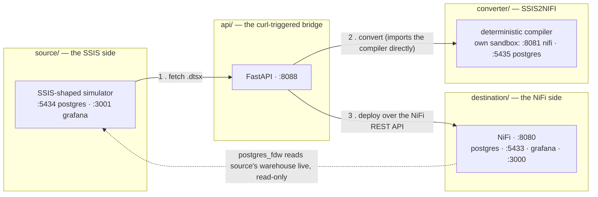
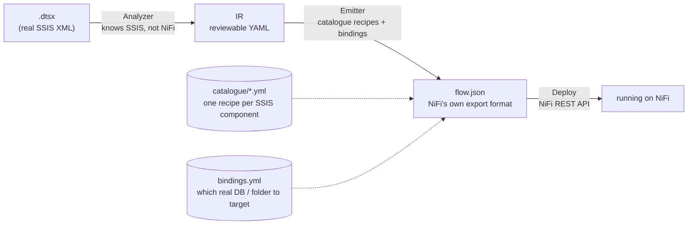
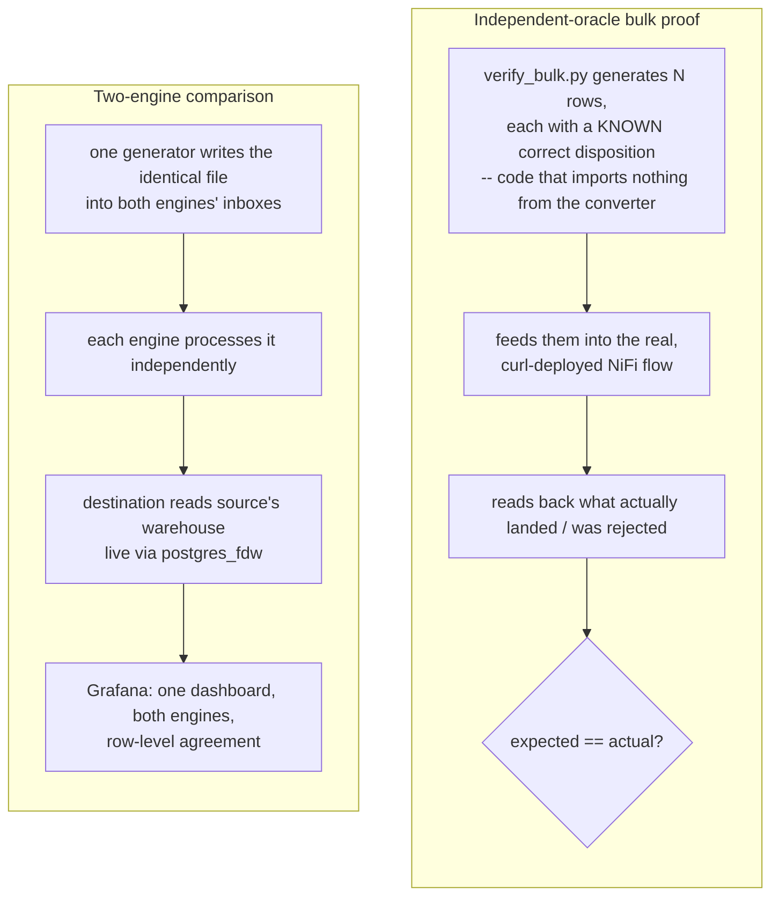

# SSIS → Apache NiFi Migration

A working demonstration that an SSIS estate can be moved to Apache NiFi with a
**deterministic compiler** instead of a rewrite — plus the tooling to trigger
that compiler over HTTP and prove, row for row, that the two engines produce
the same answer: a source SSIS-shaped system, a compiler that reads a real
`.dtsx` file and emits a real NiFi flow, an HTTP service that triggers it, and
two independent ways to prove the output is correct — every piece real and
runnable, not a mockup.

---

## Quick start

```bash
make setup       # first time only: .env files + Postgres JDBC drivers, every stack
make up-all      # source + destination + the converter's own sandbox + the api
make smoke       # confirm every stack is healthy
make ui          # opens http://localhost:8088 -- click instead of curl
```

`make help` lists every other target. Or skip the control panel and drive
it directly:

```bash
curl -sX POST localhost:8088/convert -d '{"package":"pkg_full_coverage_synthetic.dtsx"}'
curl -sX POST localhost:8088/deploy  -d '{"package":"pkg_full_coverage_synthetic.dtsx"}'
```

---

## Architecture

Four independent Docker Compose stacks, one root `Makefile`. Nothing here
duplicates logic — every root-level command delegates into the sub-project
that actually owns it.



| Stack | What it is | Owns |
|---|---|---|
| **`source/`** | A hand-built simulator standing in for a real SQL Server + SSIS install | its own Postgres, `.dtsx` packages, a Grafana |
| **`converter/`** | **SSIS2NIFI** — reads a `.dtsx`, writes a NiFi `flow.json`. A compiler, not an AI call at runtime: same input, byte-identical output, every time | its own NiFi + Postgres sandbox, used only for offline development |
| **`destination/`** | A hand-built reference NiFi pipeline (`ecommerce_etl`) *and* the warehouse/dashboards that anything deployed here writes into | the live NiFi that both the reference pipeline and every converter-generated flow target |
| **`api/`** | One FastAPI service, one file. The literal "script we trigger via curl" | nothing of its own — it imports the converter's code directly and calls destination NiFi's REST API |

Each stack has its own `README.md` / `Makefile` for the detail that belongs
to it specifically — this file covers the end-to-end story.

---

## How the converter works

`converter/` (**SSIS2NIFI**) turns a `.dtsx` file into a running NiFi
pipeline in three stages, with two file formats in between that a human can
open and read:



- **The IR is the point.** It is the artifact you hand to the person who
  owns the SSIS package and ask *"is this what it does?"* — no NiFi
  knowledge required to answer. Going straight from XML to a NiFi flow would
  make that review impossible.
- **The catalogue is data, not code.** Each supported SSIS component has one
  YAML recipe (`converter/catalogue/components/*.yml`) mapping its
  properties onto a real NiFi processor's properties. A reviewer reads one
  file and knows exactly what will be emitted; property names are always
  copied from a NiFi flow already proven to import and run, never guessed
  from documentation.
- **Every ID is deterministic** — `uuid5` of the SSIS component's own path,
  never `uuid4`. The same package compiles to byte-identical JSON every
  time, which is what makes golden-file testing and clean diffs possible.

### What it converts, honestly

| Verdict | Components | Why |
|---|---|---|
| **Supported, unconditionally** | `FlatFileSource`, `FlatFileDestination`, `OLEDBDestination`, `Lookup`, `DerivedColumn`, `ConditionalSplit` | one recipe covers the whole component |
| **Supported, narrow subset only** | `Sort` *(only pure de-duplication)*, `Aggregate` *(only `GROUP BY` with `SUM`/`MIN`/`MAX`/`COUNT`)*, Script Component *(only the single recognised `GetErrorDescription` idiom)* | the general case has no faithful NiFi equivalent; the specific safe case does, and the converter checks which one it's looking at before deciding |
| **Recognised, but no recipe yet** | `OLEDBSource` | the analyzer understands it fully; there's simply no emit recipe on disk yet, so it's skipped with a note rather than silently dropped |
| **Refused by name** | `Merge Join` | needs two independently sorted streams; NiFi's nearest processor (`JoinEnrichment`) is shaped differently and using it would risk silently wrong join semantics — the message tells you to model it as a `Lookup` instead if the second input is really a reference table |
| **Control-flow containers** (`ForEach`, `Sequence`, …) | reported, not translated | orchestration is an SSIS concept NiFi doesn't have; the tasks inside still convert |

**Refusing beats guessing, everywhere.** A component the converter doesn't
understand well enough to translate faithfully fails loudly
(`COMPONENT_REFUSED` / `COMPONENT_UNKNOWN` / `EmitError`), never as a
plausible-looking wrong answer. Exit codes make this a CI-usable contract:
`0` = every component converted cleanly, `3` = parsed fine but something
needs a human, `4` = refused outright (not a genuine `.dtsx`).

Verified by **122 unit tests**, run in a throwaway `python:3.12-slim`
container (`cd converter && make test`) so the result never depends on what
happens to be installed on the machine — plus 8 real `.dtsx` fixtures
(6 genuine SSIS packages + 2 deliberately-malformed negative cases) that
every exit code is checked against.

---

## SSIS → NiFi component mapping reference

A cross-referenced mapping of every SSIS control-flow task, container, and
data-flow component to its Apache NiFi equivalent — compiled against
Microsoft's SSIS documentation, the Apache NiFi component catalogue, and
this project's own implementation. The section above covers what this
converter actually does today; this is the full universe it draws on.

**Legend** — **1:1**: direct single-processor mapping. **N**: non-direct,
needs additional wiring. **X**: no reasonable NiFi equivalent.

### Control Flow Tasks & Containers

| SSIS item | NiFi equivalent | Fit | Notes |
|---|---|---|---|
| Execute SQL Task | `ExecuteSQL` / `PutSQL` | 1:1 | Parameterized SQL, result mapped to a flowfile |
| Bulk Insert Task | `PutDatabaseRecord` (batched) | 1:1 | Functionally equivalent |
| Transfer Database/Logins/Jobs/... (6 tasks) | — | X | Clone SQL Server metadata via SMO; out of scope for any data-movement engine |
| CDC Control Task | `QueryDatabaseTable` + custom watermark state, or Debezium | N | LSN bookkeeping has no built-in NiFi concept |
| Data Flow Task | decomposes into the tables below | — | The construct this project's compiler translates |
| File System Task | `PutFile`/`FetchFile`/`DeleteFile`/`UpdateAttribute` | 1:1 | Direct per operation |
| FTP Task | `GetFTP`/`PutFTP`/`FetchFTP`/`ListFTP` | 1:1 | Direct |
| XML Task | `TransformXml`/`EvaluateXPath`/`ValidateXml` | N | Multi-mode task, one processor per mode |
| Web Service Task | `InvokeHTTP` | N | SOAP envelope handling composed alongside the HTTP call |
| Data Profiling Task | — | X | SQL-Server-specific report format |
| Execute Package Task | Process Groups + `Wait`/`Notify` | N | Synchronous parent/child composed from NiFi primitives |
| Execute Process Task | `ExecuteProcess`/`ExecuteStreamCommand` | 1:1 | Direct |
| Message Queue Task | `ConsumeJMS`/`PublishJMS`, `ConsumeMQTT`/`PublishMQTT`, `ConsumeKafka`/`PublishKafka` | 1:1 | Direct, per queue technology |
| Send Mail Task | `PutEmail` | 1:1 | Direct |
| WMI Reader/Watcher Tasks | — | X | Windows-specific |
| Script Task (control-flow) | `ExecuteScript` | N | Runtime languages differ; recognized idioms only |
| Analysis Services Tasks | — | X | SSAS-specific, no data-flow-engine analogue |
| Maintenance Tasks (11) | `ExecuteSQL` for T-SQL-expressible ones | N/X mixed | Rest are SQL-Server-admin-specific |
| Foreach Loop Container | `ListFile` → `FetchFile` | N | File-enumerator case (the common one) degrades cleanly |
| For Loop Container | counter via `Wait`/`Notify` | X-ish | Counted imperative loop is foreign to a streaming engine |
| Sequence Container | Process Group | 1:1 | Organizational grouping |

### Data Flow Sources

| SSIS source | NiFi equivalent | Fit | Notes |
|---|---|---|---|
| **Flat File Source** | `GetFile` + `CSVReader`/`JsonTreeReader` | 1:1 | **Implemented** |
| OLE DB Source | `ExecuteSQL`/`QueryDatabaseTable` | 1:1 | Recognised by the analyzer; recipe not yet written (see Known gaps) |
| ADO.NET Source | `ExecuteSQL` | 1:1 | NiFi's JDBC pool doesn't distinguish provider technology |
| ODBC Source | `ExecuteSQL` (ODBC-bridged) | 1:1 | Direct |
| Excel Source | `ExecuteScript` (Apache POI) | N | No native XLSX record reader |
| XML Source | `XMLReader` controller service | N | Requires an explicit schema |
| Raw File Source | — | X | Proprietary SSIS serialization format |
| CDC Source | `QueryDatabaseTable` or a CDC connector | N | No native log-based CDC source |

### Data Flow Transformations

| SSIS transform | NiFi equivalent | Fit | Notes |
|---|---|---|---|
| **Conditional Split** | `QueryRecord`, dynamic SQL predicate per branch | N | **Implemented**, including default-branch synthesis |
| **Derived Column** | `QueryRecord`, SQL expression | N | **Implemented**, via a purpose-built expression translator |
| **Lookup** | `LookupRecord` + `DatabaseRecordLookupService` | 1:1 | **Implemented** |
| **OLE DB Destination** | `PutDatabaseRecord` | 1:1 | **Implemented** |
| **Sort** | `QueryRecord` `ROW_NUMBER()` | N | **Implemented** for deduplication; general ordering out of scope |
| **Aggregate** | `QueryRecord` `GROUP BY` | N | **Implemented** for `SUM`/`MIN`/`MAX`/`COUNT` |
| **Script Component** | `ExecuteScript` | N | **Implemented** for one recognized idiom |
| Multicast | native NiFi fan-out | 1:1 | Connections support one-to-many natively |
| Union All | `MergeContent`, or connection convergence | 1:1 | NiFi merges inbound connections automatically |
| Merge | — | N | No ordered-merge-of-sorted-streams primitive |
| Merge Join | `JoinEnrichment`+`ForkEnrichment`, or `LookupRecord` for reference tables | N | Reference-table case covered by this project's Lookup support |
| Data Conversion | `ConvertRecord`/`UpdateRecord` | 1:1 | Native typed schema coercion |
| Character Map | `UpdateRecord` string function | 1:1 common cases | Locale-specific maps need a scripted processor |
| Copy Column | `UpdateRecord` | 1:1 | Direct |
| Export Column | `SplitRecord` + `PutFile` | N | One-row-to-one-file needs an explicit split |
| Import Column | `FetchFile` + record-merge | N | Reverse of Export Column |
| OLE DB Command | `PutDatabaseRecord` per-record | N | Row-by-row reshaped into batch-oriented model |
| Row Count | `UpdateAttribute` | N | Attribute, not a package-scoped variable |
| Percentage/Row Sampling | `QueryRecord` randomizing predicate | N | Approximated per-flowfile |
| Pivot/Unpivot | `QueryRecord` or `JoltTransformJSON` | N | Output columns fixed at conversion time |
| Slowly Changing Dimension | `LookupRecord`+`RouteOnAttribute`+`PutDatabaseRecord` | N | Multi-step pattern in both systems |
| Fuzzy Lookup/Grouping | external similarity library | X-ish | Proprietary SQL Server algorithms |
| Term Extraction/Lookup | `ExecuteScript` + NLP library | X-ish | SSAS-text-mining-backed |
| Data Mining Query | — | X | Analysis Services dependent |
| DQS Cleansing | — | X | SQL Server Data Quality Services dependent |
| Cache Transform | `PutDistributedMapCache` | 1:1-ish | Paired with a cache-based Lookup |
| Audit | `UpdateAttribute`/provenance | 1:1 | NiFi's native lineage covers the same purpose |
| Balanced Data Distributor | — | 1:1 (structural) | NiFi processors are concurrent by configuration already |

### Data Flow Destinations

| SSIS destination | NiFi equivalent | Fit | Notes |
|---|---|---|---|
| **OLE DB Destination** | `PutDatabaseRecord` | 1:1 | **Implemented** |
| ADO.NET Destination | `PutDatabaseRecord` | 1:1 | Same mechanism as OLE DB Destination |
| ODBC Destination | `PutDatabaseRecord` (ODBC-bridged) | 1:1 | Direct |
| Flat File Destination | `PutFile` + `CSVRecordSetWriter` | 1:1 | Direct |
| Excel Destination | `ExecuteScript` (Apache POI) | N | No native writer |
| Raw File Destination | — | X | Proprietary SSIS format |
| SQL Server Destination | `PutDatabaseRecord` (batched) | 1:1 | Loses SQL Server's in-process fast-load optimization |
| Recordset Destination | — | X | In-memory SSIS variable space, no NiFi analogue |
| DataReader Destination | — | X | .NET in-process hosting API |
| Data Mining Model Training | — | X | Analysis Services dependent |
| Dimension/Partition Processing | — | X | SSAS cube processing |

---

## Repository layout

```
Final/
├── Makefile                one entry point -- make help lists everything
├── scripts/                 flow-toggle helpers, all wrapping destination NiFi's REST API
│   ├── use-generated.sh       deploy the converter's output, stop the hand-built flow
│   ├── use-handbuilt.sh       reverse
│   ├── which-flow.sh          read-only: what's live right now
│   └── clear-canvas.sh        wipe destination NiFi's canvas for a fresh demo
│
├── source/                 the SSIS side
│   ├── ssis_packages/*.dtsx    real packages available to convert
│   └── README.md               its own quick start, schema, and data-quality story
│
├── converter/               SSIS2NIFI -- the compiler, independently runnable and testable
│   ├── ssis2nifi/               dtsx/ (parser) -> catalog/ (what's convertible) -> emit/ (writes flow.json) -> deploy/ (pushes to NiFi)
│   ├── catalogue/components/*.yml   one recipe per supported SSIS component
│   ├── bindings/                  per-package "what real DB/folder does this target"
│   ├── corpus/packages/             the 8 test .dtsx fixtures
│   ├── scripts/verify_bulk.py       the independent-oracle bulk proof (see below)
│   └── README.md / DIAGRAM.md       full compiler reference, five diagram-first pages
│
├── destination/             the NiFi side
│   ├── generator/gen/build_flow.py    source of truth for the hand-built reference pipeline
│   ├── spec/pipeline.yml               the engine-neutral contract: what the pipeline promises
│   ├── db/init/04_ssis_fdw.sql         makes source's warehouse readable here, live, read-only
│   ├── grafana/dashboards/             both engines' dashboards, incl. engine-comparison.json
│   └── README.md / CLAUDE.md           full pipeline + comparison-harness reference
│
└── api/                     the curl-triggered bridge between source and destination
    ├── app.py                  FastAPI: /convert /deploy /packages /flow-status /export/rejects.csv ...
    ├── static/index.html         the control panel (make ui) -- a thin client, no logic of its own
    └── docker-compose.yml
```

---

## Control panel

`make ui` opens `http://localhost:8088` — click instead of curl. Same
endpoints either way, just fewer things to type.

- **Pick a package, click Convert** — translates the `.dtsx` into a NiFi
  flow. Offline, touches nothing live, safe to click repeatedly.
- **Click Deploy to destination NiFi** — does the same conversion, then
  pushes it onto the live NiFi and starts it. Stops whatever else is
  running first, automatically.
- **"Flows on this canvas"** — a live table of what's on the NiFi canvas
  right now, with Start/Stop per row and a Stop-all button. Turns red if
  more than one flow is ever RUNNING at once.
- **"See it running"** — one-click links: the NiFi canvas, both Grafana
  dashboards, this API's own docs, and a CSV export of every rejected
  record across both engines.

That's the whole loop: pick → Convert → Deploy → watch it land on the
canvas.

---

## Running a package end to end

```bash
# what's available to convert
curl -s localhost:8088/packages
# {"packages": ["pkg_full_coverage_synthetic.dtsx", "pkg_orders_synthetic.dtsx", ...]}

# convert only -- pure, offline, touches nothing on NiFi, safe to call repeatedly
curl -sX POST localhost:8088/convert -H 'content-type: application/json' \
  -d '{"package":"pkg_full_coverage_synthetic.dtsx"}'
```

```json
{
  "coverage": { "all_recognised": true, "recognised": 23, "total": 23 },
  "exit_code": 0,
  "exit_meaning": "every component in the package converted cleanly",
  "processors": 40,
  "connections": 54,
  "controller_services": 8
}
```

```bash
# convert AND deploy onto the live destination NiFi
curl -sX POST localhost:8088/deploy -H 'content-type: application/json' \
  -d '{"package":"pkg_full_coverage_synthetic.dtsx"}'
```

That call: fetches the `.dtsx`, converts it, stops whatever's currently
running (see below), imports the new flow, fills in the database password
from an environment variable (never written into the flow file itself),
enables every controller service, and starts it — visible immediately at
`http://localhost:8080/nifi`.

`pkg_full_coverage_synthetic.dtsx` is this repo's flagship test package: it
deliberately exercises every reject reason and every narrow-support case
(`Sort`, `Aggregate`, the Script Component idiom, a `ForEach` container, a
filtered Lookup reference) the converter understands, in one file, so a
single `/deploy` call is enough to see the whole feature set land on a real
canvas.

### Exactly one flow, ever

The hand-built `ecommerce_etl` and whatever the converter last deployed
write the **same warehouse tables**. Running both at once double-processes
every file, so only one may be `RUNNING` on destination NiFi at a time:

```bash
make which-flow       # read-only: what's live right now
make use-generated    # stop hand-built, deploy + start the converter's output
make use-handbuilt    # reverse
make clear-canvas     # wipe the canvas entirely, for a clean demo start
```

`make which-flow` warns explicitly if it ever finds more than one group
`RUNNING`.

---

## Proving the output is correct

Two independent mechanisms, because they catch different classes of bug.



**1. The independent-oracle bulk proof** (`converter/scripts/verify_bulk.py`)
answers *"does the generated flow compute the right answer at real scale?"*
without letting the tool grade its own homework — the expected result is
computed in plain Python that shares no code with the converter, the
catalogue, or NiFi.

```bash
cd converter
python3 scripts/verify_bulk.py --rows 50000 \
  --group-name ssis2nifi-pkg_full_coverage_synthetic   # match whatever `make which-flow` reports live
```

A real captured run of this technique, 50,200 rows (50,000 + a 200-row
replay batch to exercise duplicate detection) — the exact reject-category
mix depends on which package is deployed and the script's fault-rate
constants, but the shape of a passing run looks like this:

```
clean                expected=46057    actual=46057    OK
UNKNOWN_SKU          expected=969      actual=969      OK
UNKNOWN_CUSTOMER     expected=981      actual=981      OK
RANGE_VIOLATION      expected=970      actual=970      OK
BAD_CURRENCY         expected=1023     actual=1023     OK
DUP_KEY (replay)     expected=200      actual=200      OK

RESULT: agrees -- every row landed or was rejected exactly where the
independent oracle expected
```

**2. The two-engine comparison dashboard**
(`http://localhost:3000/d/engine-comparison/nifi-vs-ssis-same-data-same-answer`)
answers a different question: *"do the hand-built reference pipeline and the
SSIS simulator agree, record for record, on identical input?"* One process
writes byte-identical files into both engines' landing folders; `destination`
reads the source warehouse live through `postgres_fdw` (no copying); a set
of SQL views restrict comparison to files both engines have actually
finished, so a timing difference is never mistaken for a disagreement.

```bash
make fixture TIER=tier3-bulk     # build a frozen 50k-order dataset
make bulk-run TIER=tier3-bulk    # feed it to both engines cleanly
make compare                     # exit 0 == they agree
make check-dashboards            # run every Grafana panel query, report failures
```

A captured run against this dataset: **100% agreement, 0 differing
records**, all reject reasons matching exactly.

**Exporting the disagreement, if there ever is one.** The dashboard's
rejected-records table has a one-click CSV export
(`http://localhost:8088/export/rejects.csv`, also linked from the dashboard
title) — every rejected line from both engines, full untruncated reason,
no `Inspect → Data → Download` detour required. Built for exactly the
manual-remediation question: *which order, which line, which engine flagged
it, and why.*

---

## Command reference

```bash
make setup / up-all / down-all / smoke        # whole-repo lifecycle
make up-source / up-destination / up-converter  # start one stack at a time

make analyze FILE=...                          # what does this .dtsx do? (offline, no NiFi needed)
make convert FILE=... BINDINGS=...              # .dtsx -> flow.json, offline
make test-converter                             # 122 unit tests, in Docker

make api-up / api-down / api-logs / ui          # the curl-triggered bridge
make convert-via-api PACKAGE=...                # same conversion, over HTTP
make deploy-via-api  PACKAGE=...                # convert + deploy, over HTTP

make use-generated / use-handbuilt / which-flow / clear-canvas   # destination NiFi's canvas

make fixture TIER=... / bulk-run TIER=... / capture ENGINE=... / compare   # two-engine proof
make check-dashboards                            # sanity-check every Grafana panel query
```

Run `make help` for the full, current list with descriptions — this table is
the curated subset worth memorizing.

---

## Configuration

Every stack takes its secrets from its own `.env` (never committed;
`.env.example` alongside each one lists the required keys). The one secret
genuinely duplicated on purpose: **`api/.env`'s `ORDERS_ETL_DB_MAIN_PASSWORD`
must equal `destination/.env`'s `POSTGRES_PASSWORD`** — they authenticate to
the same warehouse under different variable names, because `api/` reaches
it as an external client rather than joining `destination/`'s own Docker
network (it connects through the host's published ports instead, so the two
stacks stay genuinely independent — `api/` never needs to know
`destination/`'s internal container names).

`make setup` creates every missing `.env` from its `.example` and fetches
the Postgres JDBC drivers both NiFi stacks need. Nothing else is required
before `make up-all`.

---

## Known gaps, stated honestly

1. **`OLEDBSource` is recognised but has no emit recipe yet.** The analyzer
   scores it as convertible; the emitter has nowhere to route it, so it's
   skipped with an explicit note in the conversion response rather than
   silently dropped. Closing this means adding
   `converter/catalogue/components/microsoft.oledbsource.yml`.
2. **`Sort` and `Aggregate` only cover their narrow, provably-safe subset**
   (pure de-duplication; `GROUP BY` with `SUM`/`MIN`/`MAX`/`COUNT`). A Sort
   used for genuine ordering, or an Aggregate using `AVERAGE`/`COUNT
   DISTINCT`, is refused rather than mistranslated — those two functions are
   exactly where SSIS and NiFi's query engine are documented to disagree on
   NULL handling.
3. **`Execute SQL Task` and other control-flow tasks aren't scored at all** —
   the converter only classifies data-flow components; a package's
   orchestration logic is reported as execution order, never generated.
4. **The generated flow's reject taxonomy is a subset of the hand-built
   flow's.** Which reasons a given package can actually produce depends on
   which components it uses — `pkg_full_coverage_synthetic.dtsx` was
   specifically built to exercise every reason the converter currently
   supports; a narrower real package will produce fewer.
5. **NiFi runs unsecured over HTTP** on both the destination and the
   converter's own sandbox — deliberate for a local demo, not
   production-appropriate as-is (no login, no TLS, no NiFi Registry-based
   flow versioning; secrets live in plaintext `.env` files rather than a
   real secret store).
