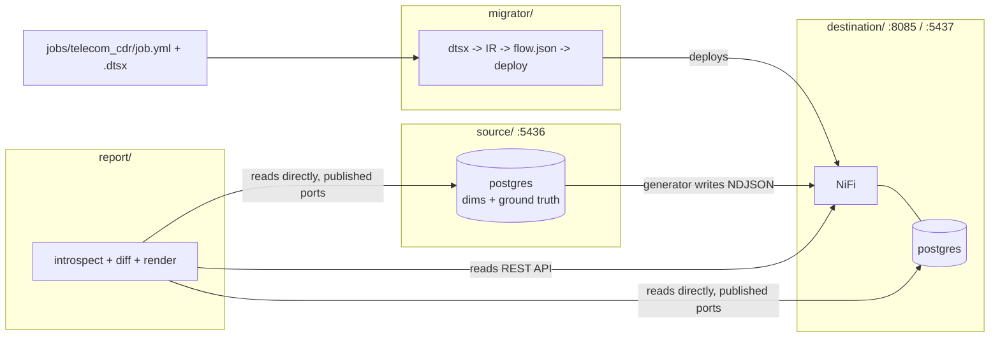

# ssis-nifi-telecom-migrator

A dynamic SSIS → Apache NiFi migration tool, proven against a real 50,000-record
telecom Call Detail Record (CDR) job, with a standalone comparison report that
shows the two engines' pipeline state and row-level agreement side by side.

This is a **separate repository** from `SSIS_NIFI-Migration-main` (the
reference project). It reuses that project's schema-agnostic compiler core
verbatim (copied, not modified — the reference repo is untouched) and adds
everything needed to make the tool genuinely job-agnostic: a per-job
configuration file replaces every hardcoded table/column name, a telecom
domain demonstrates it end to end, and a report engine built on Postgres
`information_schema` introspection replaces the reference repo's hand-written,
per-domain SQL dashboard.

---

## Why this exists

The reference repo's converter (`converter/ssis2nifi/`) already parses any
`.dtsx` and compiles it to NiFi generically — but two things in it were
specific to one "orders/ecommerce" deployment: two functions in the flow
emitter that hardcoded table names (`orders`, `order_items`,
`quarantine_records`), and a comparison mechanism (Grafana dashboards +
hand-written SQL views) that only understood that one schema. Neither is a
flaw in that repo — it does exactly what it was built for — but neither
generalizes to a new domain without editing code.

This repo:
1. **Vendors** the parts of the compiler that were already schema-agnostic
   (`dtsx/`, `catalog/`, `catalogue/*.yml`, the NiFi deploy client) unchanged.
2. **Generalizes** the one part that wasn't: the flow-level job-run ledger is
   now driven entirely by a job's own `job.yml`, and the hardcoded
   "high-value order" alerting logic (which had no domain-neutral equivalent)
   was removed rather than faked.
3. **Adds a genuinely dynamic report engine** alongside a Grafana dashboard:
   `report/` discovers each table's primary key and columns at run time via
   `information_schema` — the same report code runs against telecom's
   `fact_calls`/`quarantine_cdr` today and against a different job's tables
   tomorrow, with no code change. Grafana (`destination/grafana/dashboards/`)
   is the one piece that's honestly still per-job, same as the reference
   repo's own board: a Grafana panel's SQL is a JSON file, not Python, so it
   can't introspect a schema at query time the way `report/` does — it's a
   live companion view for the one job it was written for, not the
   job-agnostic proof.
4. **Demonstrates** all of the above with one concrete job: 50,000 synthetic
   telecom CDRs, migrated and compared end to end.

See `docs/GENERICITY.md` for the specific evidence that nothing here is
telecom-specific: the same CLI, unmodified, converting an orders-domain
package from the reference repo's own test corpus.

---

## Architecture

Two independent Docker Compose stacks (deliberately different ports from the
reference repo, so both can run on one machine at once):

```
source/         postgres :5436  -- telecom reference dims + the
                                    "what SSIS would have computed" ground
                                    truth (see source/telecom_stream/gen)
destination/    nifi :8085, postgres :5437, grafana :3002 -- the live NiFi
                                    the migrated flow runs on, plus a live
                                    two-warehouse dashboard
migrator/       the dynamic migration tool (CLI): .dtsx -> IR -> flow.json
                -> deployed NiFi process group
report/         the dynamic comparison report (CLI): introspects both
                Postgres instances + NiFi's REST API, writes HTML + JSON
jobs/telecom_cdr/  the one concrete job: its .dtsx, its job.yml
```



---

## The one place any job's facts live: `job.yml`

Everything under `migrator/ssis2nifi/` and `migrator/catalogue/` is
schema-agnostic — verified by `migrator/tests/` running the vendored test
suite unmodified, and by converting one of the reference repo's own
orders-domain corpus packages through this tool with zero code changes (see
`jobs/_smoketest_l1/`). The **only** place a table name, column name, or
deployment target appears is a job's own `job.yml`:

```yaml
name: telecom_cdr
package: pkg_telecom_cdr.dtsx

nifi:
  url: http://localhost:8085

destination_db: {...}   # where the migrated flow writes
source_db: {...}        # the SSIS-equivalent warehouse, for the report

ledger:                 # optional job-run bookkeeping
  table: control.job_run_log
  reject_tables: [quarantine_cdr]

compare:                # what the report compares
  fact_table: fact_calls
  reject_table: quarantine_cdr
  reason_column: reason
```

See `migrator/jobconfig.py`'s docstring for the full schema.

---

## Quick start

```bash
make setup                        # .env files, JDBC driver, local venv
make up                           # both Docker stacks
make migrate JOB=telecom_cdr      # convert + deploy the telecom job onto NiFi
make generate-data JOB=telecom_cdr ROWS=50000   # 50k synthetic CDRs
# wait for NiFi's queues to settle (watch http://localhost:8085/nifi, or
# http://localhost:3002 -- Grafana, admin/admin by default -- live)
make compare-report JOB=telecom_cdr             # out/reports/telecom_cdr-*.html
```

`make help` lists every target. `make test` runs the full unit suite (no
Docker required — it's the vendored converter core plus report logic tested
against synthetic data).

> **Note on this environment:** the sandbox this repo was built in has no
> access to a Docker daemon, so the Docker-dependent steps above (`up`,
> `migrate`, `generate-data`, `compare-report` against real Postgres/NiFi)
> were not run end-to-end here. Everything that could be verified without
> Docker was: the `.dtsx` parses and converts cleanly (17/17 components,
> 29 processors, 0 recognition gaps), the full unit suite passes (69 tests),
> and the report engine's diff/render logic is covered by tests against
> synthetic captures. Run the commands above on a machine with Docker to
> exercise the rest.

---

## Repository layout

```
migrator/                  the migration tool
  ssis2nifi/                 vendored from the reference repo's converter/,
                              unmodified except emit/flowdef.py (see below)
  catalogue/                  vendored component recipes, unmodified
  jobconfig.py                 loads job.yml
  bindings.py                  auto-generates bindings.yml from a package's
                                own connections + job.yml's deployment target
  sidecar.py                   records which columns a package's destinations
                                declare, from the IR -- documents the report's
                                assumption that a source column lands under
                                the same name in the destination table
  cli.py                       analyze / convert / deploy
  tests/                       vendored (bindings-free) converter tests +
                                new tests proving the ledger/alerts changes

report/                     the comparison report
  introspect.py                information_schema PK + column discovery
  capture.py                    builds count/key-set/histogram captures
  diff.py                       compares two captures
  pipeline_state.py             NiFi REST state + source job-run ledger
  render.py                     HTML + JSON output
  cli.py                        compare-report

jobs/telecom_cdr/           the demo job
  generate_pkg_telecom_cdr.py    builds pkg_telecom_cdr.dtsx from scratch
  job.yml

source/                     telecom warehouse + batch generator (Docker)
destination/                NiFi + telecom warehouse (Docker)
  grafana/provisioning/       datasources.yml (both warehouses, direct
                               connection) + dashboards.yml (the provider)
  grafana/dashboards/          telecom-comparison.json -- row counts, reject
                               reasons, recent job runs, source vs destination
docs/GENERICITY.md          the evidence that nothing here is telecom-specific
```

---

## What changed in the vendored `flowdef.py`, and why

`migrator/ssis2nifi/emit/flowdef.py` is the one vendored file with real
edits (everything else under `ssis2nifi/` and `catalogue/` is byte-for-byte
copied):

- **`_add_alerts` was removed entirely.** It flagged "high-value order
  lines" using hardcoded `line_total > 500` / `qty > 50` thresholds and a
  fixed `alerts` table — genuinely ecommerce-specific business logic with no
  domain-neutral equivalent, so it was deleted rather than generalized into
  something meaningless.
- **`_add_job_ledger` is now config-driven and opt-in.** It used to
  unconditionally assume three fixed table names (`orders`, `order_items`,
  `quarantine_records`). It now does nothing unless a job's `bindings.yml`
  carries a `ledger:` block (populated from `job.yml`), and when it does, the
  ledger table name and which destination tables count as rejects both come
  from that config — verified by `migrator/tests/unit/test_ledger_generalization.py`,
  which builds a flow with an arbitrary, made-up ledger table name and
  asserts it appears in the generated SQL, and that neither `job_runs` nor
  any orders-domain literal ever does.

---

## Design decisions worth knowing

- **No `postgres_fdw`, for either the report or Grafana.** The standalone
  report (`report/cli.py`) and Grafana's two datasources both reach each
  Postgres instance directly over its published port (the same trick the
  reference repo's own `api/app.py` already uses for its CSV export) — no
  cross-stack Docker networking, no foreign-table setup. Grafana
  (`destination/docker-compose.yml`'s `grafana` service, `:3002`) is additive
  to the one-shot HTML/JSON report, not a replacement for it: the report is
  the artifact you'd attach to a sign-off or archive per run; Grafana is for
  watching row counts and reject reasons live across both warehouses while a
  batch is in flight. Deliberately NOT in Grafana: NiFi's own processor/queue
  state — Grafana has no built-in NiFi REST support, and the standalone
  report already covers that (`report/pipeline_state.py`).
- **The generator plays "SSIS engine."** Rather than build a second full
  ingest engine to independently reprocess landing files (what the reference
  repo's `stream_runner.py` does), `source/telecom_stream/gen` writes its own
  already-known-correct disposition straight into source Postgres as it
  writes each landing file — the same "the generator IS the independent
  oracle" idea as the reference repo's `converter/scripts/verify_bulk.py`,
  applied to the source side instead of a one-off verification script. See
  `source/telecom_stream/gen/emit.py`'s docstring for the full reasoning.
- **Fault injection never changes a field's JSON type.** The reference repo
  hit a real bug where a field that was sometimes a number and sometimes a
  string made NiFi's schema inference synthesize an Avro CHOICE type that
  `PutDatabaseRecord` refuses to write. Every fault this generator injects
  (`source/telecom_stream/gen/faults.py`) is an out-of-domain *value* within
  a stable *type* (an unknown ID, an out-of-range integer) — avoiding that
  whole bug class by construction instead of working around one instance of
  it.
- **No `Merge`/duplicate-key handling.** `pkg_telecom_cdr.dtsx` has no
  duplicate-detection branch, so the generator never emits a duplicate
  `call_id` — a documented scope choice, not an oversight (see
  `faults.py`'s module docstring).
