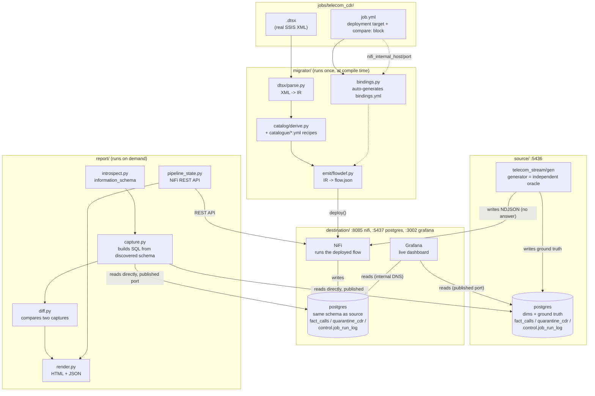

# Architecture

One diagram, covering the whole system: two Docker stacks (`source/`,
`destination/`), one migration tool (`migrator/`), one report engine
(`report/`), tied together by one job definition (`jobs/telecom_cdr/`).



## Compile time vs. runtime — the distinction that trips people up

The `.dtsx` and `migrator/` only run **once**, when you execute `migrator
convert` / `migrator deploy` (`make migrate`). After that, NiFi has no idea
SSIS or this repo's compiler ever existed — it just runs the `flow.json`
that got produced.

```
compile time (make migrate)          runtime (make generate-data, always-on)
──────────────────────────           ───────────────────────────────────────
.dtsx ─▶ migrator/ ─▶ flow.json       generator ─▶ landing dir ─▶ NiFi ─▶ postgres
              │                            │
              └─▶ deployed once            └─▶ ground truth written to
                  onto NiFi                    source postgres, every batch
```

## What's dynamic vs. what's config, at a glance

| Layer | Dynamic (discovered) | Config (`job.yml`) |
|---|---|---|
| Migration | every table/column name, component wiring, SQL expressions — all read from the `.dtsx` itself | deployment target (`destination_db`), landing dir, ledger table name |
| Report | primary key + full column list per table (`information_schema`) | which tables to compare (`compare.fact_table`/`reject_table`), which column holds the reject reason |

See `docs/FAQ.md` for the detailed walkthrough of each piece, and
`docs/GENERICITY.md` for the evidence that the same `migrator/` code
converts an unrelated orders-domain package with zero changes.
